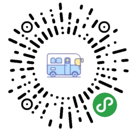

# 上海公交小程序

> `mp-vue` 框架练习 

## 技术栈

### 服务端

+ `nodejs` 作为中间层代理高德地图api与上海公交api
+ `pm2` 管理服务
+ `nginx` 代理 `https` 服务

### 客户端

+ `mpvue` 框架进行组件化开发
+ `scss` 处理器模块化开发 `sss`

## 功能

+ 附近公交信息
+ 公交的详细信息
+ 公交到站的实时信息
+ 收藏站点，方便查看到站信息
+ 反馈建议

## 特色功能

> 无

## 小程序二维码


## Build Step

```bash

# install dependencies
npm install

# serve with hot reload at localhost:8080
npm run dev

# build for production with minification
npm run build

# build for production and view the bundle analyzer report
npm run build --report

```
